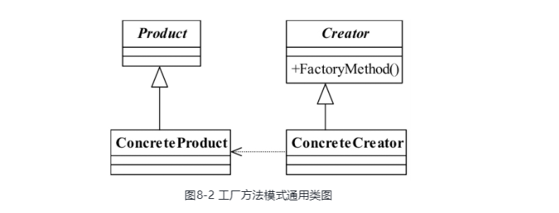

# 设计模式重读

## 六大原则

1. Single Responsibility Principle,SRP 单一职责原则

    > 应该有且仅有一个原因引起类的变更. 可以使用在接口,类,方法上 .  开发简单 , 维护改动小.
2. 里式替换原则 所有引用基类的地方都可以透明的使用其子类 , 通俗的说, 父类出现的地方,子类都可以替代, 不会产生异常 , 反之,子类出现的地方, 父类未必能适应.
    todo:委托模式, 解决玩具枪杀人问题
3. 依赖倒置原则 , 模块间的依赖通过抽象发生 . 接口和抽象类不依赖于实现类,实现类依赖接口和抽象类 .
    >依赖正置就是类间的依赖是实实在在的实现类间的依赖，也就是面向实现编程，这也是正常人的思维方式，我要开奔驰车就依赖奔驰车，我要使用笔记本电脑就直接依赖笔记本电脑，而编写程序需要的是对现实世界的事物进行抽象，抽象的结果就是有了抽象类和接口，然后我们根据系统设计的需要产生了抽象间的依赖，代替了人们传统思维中的事物间的依赖，“倒置”就是从这里产生的。
                                                                                                                                                                         >
    ```java
   //依赖注入的几种方式
   package demo02;
   
   /**
    * setter 和 构造器注入
    */
   public class Soldier {
       private AbstractGun gun;
   
       public void setGun(AbstractGun abstractGun) {
           this.gun = abstractGun;
       }
       
       public Soldier(){
           
       }
       public Soldier(AbstractGun gun){
           this.gun = gun;
       }
   
       /**
        * 杀死敌人
        */
       public void killEnemy() {
           gun.shoot();
       }
   }

   /** 接口注入 */
   public interface IDriver {
       void DriverCar(ICar car);
   }
   
   
   
   ```

4. 接口隔离原则  类间的依赖关系应该建立在最小接口依赖上 , 提供小的专有接口,而非大而全的接口
5. 迪米特法则  最少知识原则 , 一个类应该对其他对象有最少的了解.
6. 开闭原因   对拓展开放, 都修改关闭 .具体的说 ,需求的变更尽量不修改原有的代码.  可以用过抽象(接口不变, 拓展实现类) ,元数据控制(配置文件,典型的是spring的bean管理)实现 .

## 设计模式

### 单例模式

---
    > Ensure a class has only one instance, and provide a global point of access to it.
    （确保某一个类只有一个实例，而且自行实例化并向整个系统提供这个实例。）

#### 饿汉单例模式

1. 饿汉单例模式下 , 初始化会创建final类型的变量, 保证实例唯一  , 不存在线程安全问题

```java
package demo_singleton;

/**
 * 单例模式 , 饿汉模式 , 访问的时候 ,立刻创建一个对象
 */
public class Singleton {
    private static final Singleton singleton = new Singleton();

    /**
     * 私有化构造方法
     */
    private Singleton() {

    }

    /**
     * 提供一个静态方法
     * @return 返回一个实例
     */
    public static Singleton getInstance() {
        return singleton;
    }
}

```

2. 懒汉单例模式 , 有比较好的性能 , 存在线程安全问题

```java
/**
 * 懒汉 单例模式 , 可能出现线程安全问题 ,  测试结果显示  其他的线程访问了构造函数 , 创建了对象 , 需要修改为线程安全的
 * pool-1-thread-2线程调用了构造函数
 * pool-1-thread-5线程调用了构造函数
 * pool-1-thread-3线程调用了构造函数
 * pool-1-thread-4线程调用了构造函数
 * pool-1-thread-1线程调用了构造函数
 */
public class SingletonLazy {
    private static SingletonLazy singletonLazy = null;

    private SingletonLazy() {
        System.out.println(Thread.currentThread().getName() + "线程调用了构造函数");
    }

    public static SingletonLazy getInstance() {
        if (singletonLazy == null) {
            singletonLazy = new SingletonLazy();
        }
        return singletonLazy;
    }

    public static void main(String[] args) {
//        ExecutorService service = Executors.newFixedThreadPool(8);
        ExecutorService service = new ThreadPoolExecutor(8,16,0L,TimeUnit.MILLISECONDS,new ArrayBlockingQueue<Runnable>(1024));
        for (int i=0;i<1000;i++){
            service.submit(()-> SingletonLazy.getInstance());
        }
    }
}
```

```java
/**
 * 懒汉 单例模式 , 可能出现线程安全问题
 * pool-1-thread-2线程调用了构造函数
 * 方案1 ,  工厂方法上加上 synchronized关键字 , 加锁 ,ok , 每次访问方法 , 都需要获得锁 , cpu 在等待 
 */
public class SingletonLazy {
    private static SingletonLazy singletonLazy = null;
//private volatile static SingletonLazy singletonLazy = null;

    private SingletonLazy() {
        System.out.println(Thread.currentThread().getName() + "线程调用了构造函数");
    }

    public static synchronized SingletonLazy getInstance() {
        if (singletonLazy == null) {
            singletonLazy = new SingletonLazy();
        }
        return singletonLazy;
    }

    public static void main(String[] args) {
//        ExecutorService service = Executors.newFixedThreadPool(8);
        ExecutorService service = new ThreadPoolExecutor(8,16,0L,TimeUnit.MILLISECONDS,new ArrayBlockingQueue<Runnable>(1024));
        for (int i=0;i<1000;i++){
            service.submit(()-> SingletonLazy.getInstance());
        }
    }
}
```

```java
package demo_singleton;

import java.util.concurrent.ArrayBlockingQueue;
import java.util.concurrent.ExecutorService;
import java.util.concurrent.ThreadPoolExecutor;
import java.util.concurrent.TimeUnit;

/**
 * 使用静态内部类 , 保证线程安全
 */
public class SingletonM {

    private SingletonM(){
        System.out.println(Thread.currentThread().getName()+"访问构造函数");
    }

    private static class SingletonHolder{
        private static final SingletonM instance = new SingletonM();
    }

    public static SingletonM getInstance() {
        return SingletonHolder.instance;
    }

    public static void main(String[] args) {
        ExecutorService service = new ThreadPoolExecutor(8,16,0L, TimeUnit.MILLISECONDS,new ArrayBlockingQueue<Runnable>(1024));
        for (int i=0;i<1000;i++){
            service.submit(()->SingletonM.getInstance());
        }
    }
}
```

```java
package demo_singleton;

/**
 * 使用枚举值 , 保证线程安全
 */
public enum SingleEnum {
    INSTANCE;
    private SingleEnum(){
        System.out.println(Thread.currentThread().getName()+"访问构造函数");
    }
}
```

### 工厂模式
---
    > Define an interface for creating an object,but let subclasses decide which class toinstantiate.Factory Method lets a class defer instantiation to subclasses.
    （定义一个用于创建对象的接口，让子类决定实例化哪一个类。工厂方法使一个类的实例化延迟到其子类。）



```java

/** 抽象工厂方法 ,采用泛型 */
public abstract class AbstractHumanFactory {
    public abstract <T extends Human> T createHuman(Class<T> c);
}

/**
 * 抽象工厂的具体实现类 ,
 * 使用泛型 + 反射 , 实例化的对象,由子类决定
 * 如果去掉 抽象工厂 , createHuman 变为静态方法 , 则降级为简单工厂模式 , 去掉了拓展 , 不符合开闭原则
 */
public class HumanFactory extends AbstractHumanFactory {
    @Override
    public <T extends Human> T createHuman(Class<T> c) {
        Human human = null;
        try {
            human = (Human) Class.forName(c.getName()).newInstance();
        } catch (InstantiationException | IllegalAccessException | ClassNotFoundException e) {
            e.printStackTrace();
        }
        return (T) human;
    }
}

/**
 * human 的抽象
 */
public interface Human {
    /**
     * 获得肤色
     */
    void getColor();

    /**
     * 可以交流
     */
    void talk();
}

public class YellowHuman implements Human{
    @Override
    public void getColor() {
        System.out.println("黄色皮肤");
    }

    @Override
    public void talk() {
        System.out.println(this.getClass()+"在说话");
    }
}

public class Client {
    public static void main(String[] args) {
        AbstractHumanFactory abstractHumanFactory = new HumanFactory();
        Human yellowHuman = abstractHumanFactory.createHuman(YellowHuman.class);
        yellowHuman.talk();
        Human blackHuman = abstractHumanFactory.createHuman(BlackHuman.class);
        blackHuman.talk();
        Human  whiteHuman = abstractHumanFactory.createHuman(WhiteHuman.class);
        whiteHuman.talk();
    }
}

```


### 抽象工厂模式

---
Provide an interface for creating families of related or dependent objects without specifyingtheir concrete classes.
（为创建一组相关或相互依赖的对象提供一个接口，而且无须指定它们的具体类。）
```java
public interface Human {
    void getColor();
    void getSex();
    void talk();
}
/** 抽象类 ,实现了接口的共有方法 */
public abstract class AbstractYellowHuman implements Human {
    public void getColor(){
        System.out.println("黄色皮肤");
    }
    public void talk(){
        System.out.println(this.getClass()+"在说话");
    }

}

/**  实现特有方法*/
public class MaleYellowHuman extends AbstractYellowHuman {
    @Override
    public void getSex() {
        System.out.println("男性");
    }
}

public class FemaleYellowHuman extends AbstractYellowHuman {
    @Override
    public void getSex() {
        System.out.println("女性");
    }
}
/**  工厂方法 */
public class MaleFactory implements HumanFactory {
    @Override
    public Human createYellowHuman() {
        return new MaleYellowHuman();
    }

    @Override
    public Human createWhiteHuman() {
        return new MaleWhiteHuman();
    }
}

public class FemaleFactory implements HumanFactory {
    @Override
    public Human createYellowHuman() {
        return new FemaleYellowHuman();
    }

    @Override
    public Human createWhiteHuman() {
        return new FemaleWhiteHuman();
    }
}

public class Client {
    public static void main(String[] args) {
//       第一条生成线 , 女性生产线 , 生产女性人种
        HumanFactory femaleFactory = new FemaleFactory();
        femaleFactory.createYellowHuman().getColor();
        femaleFactory.createWhiteHuman().getColor();
//        第二条生成线, 男性生成线 ,生产女性人种
        MaleFactory maleFactory = new MaleFactory();
        maleFactory.createYellowHuman().getColor();
        maleFactory.createWhiteHuman().getColor();
    }
}
```
### 模板模式

---

Define the skeleton of an algorithm in an operation,deferring some steps tosubclasses.Template Method lets subclasses redefine certain steps of an algorithm withoutchanging the algorithm's structure.（定义一个操作中的算法的框架，而将一些步骤延迟到子类中。使得子类可以不改变一个算法的结构即可重定义该算法的某些特定步骤。）

通过继承机智实现  , 模板方法 使用final 修饰 , 防止子类复写 .

```java
/** 负责提供模板方法 ,run */
public abstract class BenzModel {
    abstract void start();

    abstract void stop();

    abstract void alarm();

    /**
     * hook method  , 外界条件的改变 ,影响模板方法的执行 .
     * @return
     */
    abstract boolean isAlarm();

    /**
     * 模板方法 , 加上final 修饰 , 防止被复写 ,
     * 子类通过 isAlarm 控制了父类的行为
     */
    final void run() {
        start();
        if (this.isAlarm()) {
            alarm();
        }
        stop();
    }
}
```

```java
public class BenzH1Model extends BenzModel {
    @Override
    void start() {
        System.out.println("benz1" + "启动了");
    }

    @Override
    void stop() {
        System.out.println("benz1" + "停止了");
    }

    @Override
    void alarm() {
        System.out.println("benz1" + "按喇叭");
    }

    @Override
    boolean isAlarm() {
        return true;
    }
}
```

### 建造者模式

---

Separate the construction of a complex object from its representation so that the sameconstruction process can create different representations.（将一个复杂对象的构建与它的表示分离，使得同样的构建过程可以创建不同的表示。）

```java
/**
 * 产品类 ,  可以自定义执行顺序  , 或 装配不同零件
 * 同样实现了模板模式
 */
public abstract class CarModel {
    private ArrayList<String> sequence = new ArrayList<>();
    abstract void start();

    abstract void stop();

    abstract void alarm();

    final void run() {
        for (int i=0;i<sequence.size();i++){
            String s = sequence.get(i);
            if("start".equalsIgnoreCase(s)){
                this.start();
            }
            if("stop".equalsIgnoreCase(s)){
                this.stop();
            }
            if("alarm".equalsIgnoreCase(s)){
                this.alarm();
            }
        }
    }

    final void setSequence(ArrayList sequence){
        this.sequence = sequence;
    }

}
```

```java
/**
 * 抽象的建造者 ,
 * 具体的功能由具体实现类实现
 */
public abstract class CarBuilder {
    abstract void setSequence(ArrayList<String> sequence);
    abstract CarModel getCarModel();
}
```

```java
/**
 * 导演类 , 封装了构造过程 , 返回构造后的对象
 */

public class Director {
    private ArrayList<String> sequence = new ArrayList<>();
    private BenzBuilder benzBuilder = new BenzBuilder();
    public CarModel getABenzModel(){
        this.sequence.clear();
        sequence.add("alarm");
        sequence.add("start");
        sequence.add("stop");
        benzBuilder.setSequence(sequence);
        return benzBuilder.getCarModel();
    }


    public CarModel getBBenzModel(){
        this.sequence.clear();
        sequence.add("start");
        sequence.add("stop");
        benzBuilder.setSequence(sequence);
        return benzBuilder.getCarModel();
    }
}
```


### 代理模式

### 原型模式

### 中介者模式

### 命令模式

### 责任链模式

### 装饰模式

### 策略模式

### 适配器模式

### 迭代器模式

### 组合模式

### 观察者模式

### 门面模式

### 备忘录模式

### 访问者模式

### 状态模式

### 解释器模式

### 享元模式

### 桥梁模式
